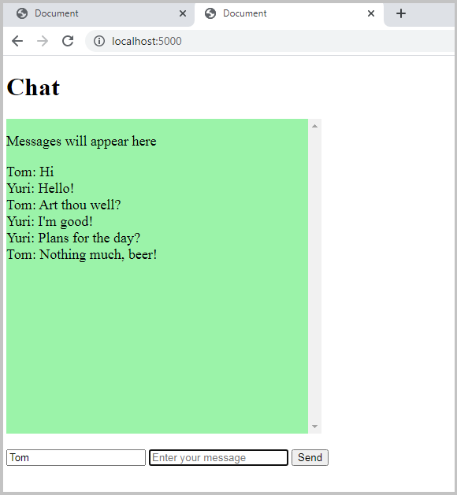

# Simple chat

### A barebones implementation of Flask-socketIO

#### Intro

This is a very simple implementation of Flask-socketIO, based on their excellent [documentation](https://flask-socketio.readthedocs.io/en/latest/). To keep things simple, I have added almost no styling. The documentation also details how rooms might be added, I have left these out, again, to keep things simple.

#### How to use

Set up a simple Flask application, add Flask-socketIO to it then run your server. Open at least two tabs then start chatting!!

#### How it was implemented