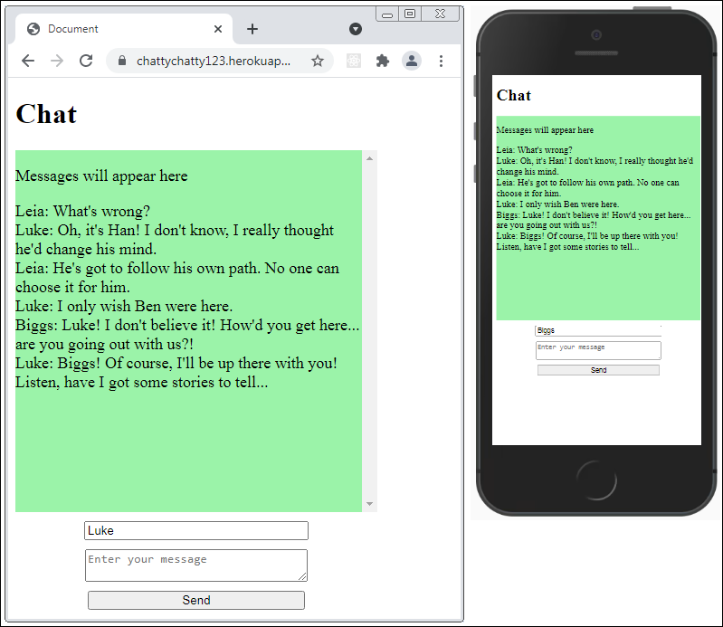

# **Simple chat**

##### *A bare-bones implementation of Flask-SocketIO*

___

*Image - a conversation between three people in progress.*

##### Try it out

<a  href="https://chattychatty123.herokuapp.com/"  target="_blank">Click here to launch the deployed app</a>

Open the app in two or more tabs or even different devices, enter an username and begin sending messages to all connected clients!

##### Intro

This is a very simple implementation of Flask-socketIO, based on their excellent [documentation](https://flask-socketio.readthedocs.io/en/latest/). To keep things simple, almost no styling has been added & no rooms have been implemented.

#### How it works

The clients fire a method emit() every time a user types a message. The emit() method takes two arguments: the users text and an additional argument and pass them to the server. The additional argument is simply a specific string that the server is listening for (very similar to a Flask route). Upon receiving this string, the server itself fires an emit() method. This in turn is being listened for by the client. Upon receiving it, the client will update the UI by injecting the message area with the new message.

#### Tech used

* Flask (for backend duties)

* Flask-SocketIO & SocketIO (for establishing socket endpoints on clients and the server)

* gunicorn (for running the Pyhon code on the server)

* gevent, greenlet (for efficiently managing messages going into and out of the server)

* gevent-websocket (for keeping a connection open between a client and the server)

* Python3

#### Code explanation

##### Procfile

The Procfile contains the following command:

**`web: gunicorn -k gevent -w 1 app:app`**

`web:` tells Heroku to expect external HTTP traffic

`gunicorn -k` run guncorn server with the -k argument (meaning that we will use a worker class with gunicorn) A worker class operates in its own thread separate from our app. In this case, the worker 'gevent' will deal with incoming and outgoing messages.

`gevent -w 1` specify gevent as our worker class. The -w 1 argument specifies that we want to use one worker in this instance. Because of a limitation with gunicorn, we cannot specify any more than 1 worker. There are other options to using gevent detailed in the Flask-SocketIO documentation.

`app:app` the first 'app' refers to our app.py file whilst the second 'app' refers to the actual instance of our app we create at runtime.

##### app.py:

Passes the app instance into a socket for use on the server. The socketIO 'on()' decorator functions just like a standard Flask route - when the server detects a string (in this case 'message') it will trigger the handle\_message() method. The handle\_message() method 'emits' a string to all connected clients. The emit() method sends messages to all connected clients and is used here for simplicity. More specific recepients can easily be targeted.

##### script.js

Creates a socket for use on the client. Takes the form fields and sends them to the server upon user click. Listens for messages from the server and updates the message display area on the client upon receiving messages.

##### index.html:

This page grabs socketIO from a CDN. It displays the form fields the user will use for their username and message input. It implements the above script.js

#### Deployment (local)

First, clone the repo. You'll then have to install all the requirements with `pip install -r requirements.txt`. Run the application with `python app.py`. This will spin up a server on your machine with a default port of 5000. Open at least two browser tabs and navigate them to `localhost:5000`. Now enter a username and start sending messages.

#### Deployment (web)

You'll need to create a 'SECRET_KEY' enviornment variable in Heroku. If your using gevent as described here, there is a possibility that it can conflict with eventlet (should that also be installed in the enviornment) as they compete for resources. Try uninstalling eventlet if your having issues.